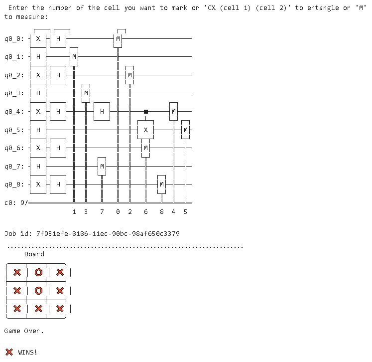

# Welcome to IonQ + Microsoft Joint Challenge @ MIT iQuHACK 2022! #QuantumTicTacToe


[Michael Kougang](https://github.com/RoyalWeden), [Henry Atkins](https://github.com/henry-dev-atkins), [Ananya Shukla](https://github.com/ShuklaAnanya), [Swaraj Purohit](https://github.com/anomius)
-------------------------------------------------------------

****

The game we will be quantizing today is none other than the infamous tic tac toe! Here, “Quantizing” a game simply means introducing quantum effect into the game. 
For those who have never heard of it, Tic tac toe is a 2-player strategy game, where players take turns to place their marking (either "O" or "X") on a 3x3 board. The goal is to form a straight line from 3 markings, which can be straight or diagonal.

Our qubit tic tac toe is the extension of Schoridnger’s cat — but instead of 1 box, we have 9 boxes with 9 cats inside. Before opening the box and performing a measurement, you can perform all sorts of unitary operations on the box as long as it is non-destructive. The goal is to keep 3 cats alive in a straight line. Why does this happen to our poor cat? Well. who knows, let’s just "shut up and play the game"!

## Instructions
----------------------------------------------------
0. In X's turn, X applies an X (pauli) and H (Hadamard) gate on the chosen
   cell.
1. In O's turn, O applies a H gate on the cell of choice.
2. To select the cell to claim, type an integer (0-8) when prompted. 
   X's cells are labelled 1, and O's cells are labelled 0.
3. Players may take their turn on existing cells
   to change its state.
4. To entangle two cells, players can apply the
   CX gate to two cells through the command
   CX (first cell) (second cell). e.g. CX 4 5.
5. When a player wants to use the current state
   of the board to get results, they can measure it
   with 'm'. Warning: only play this if you think you'll win!
6. Have fun!

#### <u>How to win</u>
----------------------------------------------------

When a measurement occurs, the one with a win state in classical tic tac toe wins.

##  The Board
----------------------------------------------------

```bash
┌───┬───┬───┐
│ 0 │ 1 │ 2 │
├───┼───┼───┤
│ 3 │ 4 │ 5 │
├───┼───┼───┤
│ 6 │ 7 │ 8 │
└───┴───┴───┘
```


### Sample Runthrough





```bash
git clone https://github.com/RoyalWeden/2022_microsoft_ionq_challenge.git
cd 2022_microsoft_ionq_challenge
./setup.sh
```

## Motivation
Eveyone now and then likes to have some time to relax. What better way to do this by playing a childhood classic — tic tac toe. However, with a slight quantum twist. Since quantum computing is still in an early stage of development, we wanted to be able to find the best game possible to use the IonQ quantum computer. Will you be able to achieve victory in this quantumized tic tac toe?

## Gameplay
In the beginning, there are two players: X's and O's. Each player takes a turn deciding from one of the three possible moves:
1. Mark/Label a square from 0 to 8 as their own (X's will place a '1' and O's will place a '0' on the selected square.).
2. Entangle two squares no matter their current state with the Controlled-X gate (Example command: CX 2 5).
3. Measure the board to finalize the results and end the game.

Let us take 3 rounds, for example, however, in a normal game, the game board will need to be filled before either player can end the game by measuring the board. In round 1, player X may mark cell 2 and player O may mark cell 5. In round 2, player X may mark cell 0 and player O may mark cell 8. In the last round, player X may mark cell 5 and player O may entangle cells 8 and 1. In the round after, player X may decide to measure the board, hence, ending the game. To note where each round starts and ends, the circuit below is denoted with barriers.

#### <u>Example Circuit</u>
------

------

### Team Experience at iQuHACK 2022
Our experience as a team at the Interdisciplinary Quantum Hackathon 2022 by MIT has been a great learning experience. Through the expert sessions and talks with industry specials and leading researchers, we became even more motivated and enlightened. This hackathon has given us an wonderful platform to exercise our knowledge in the field of quantum computation and computer programming to work on something unique, fulfilling, and fun. We are extremely grateful for opportunity given by the iQuHack Staff and are utmost sure that this hackathon has motivated us to contribute our time and effort as a part of the future quantum workforce.

## Link to the presentation:
https://www.canva.com/design/DAE27cvEZ1w/hfnhZ23s4G40aQMkOKCVGw/view?utm_content=DAE27cvEZ1w&utm_campaign=designshare&utm_medium=link&utm_source=sharebutton


## Bibliography
----------------------------------------------------

1) https://medium.com/@toohonlin/develop-quantum-mechanics-intuition-through-quantum-game-qubit-tic-tac-toe-d9814bc927dc
2) https://www.researchgate.net/publication/338113536_Quantum_Tic-Tac-Toe_A_Hybrid_of_Quantum_and_Classical_Computing
