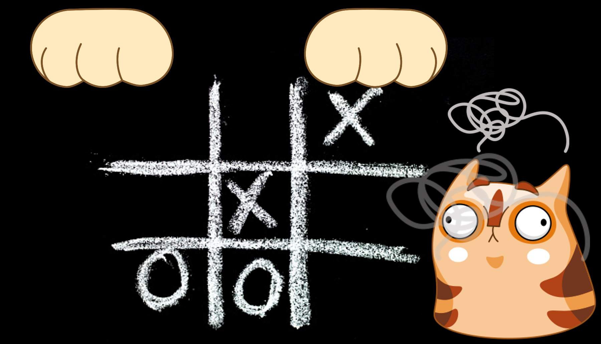

# Quantum Tic Tac Toe

Michael Kougang, Henry Atkins, Ananya Shukla, Swaraj Purohit
-------------------------------------------------------------
The game we will be quantizing today is none other than the infamous tic tac toe!“Quantizing” a game simply means introducing quantum effect into the game. 
For those who have never heard of it, Tic tac toe is a 2-player strategy game, where players take turns to place their marking(either “O” or “X”) on a 3x3 board. The goal is to form a straight line from 3 markings.

Our qubit tic tac toe is the extension of Schoridnger’s cat — but instead of 1, we have 9 black boxes with 9 cats inside. Before opening the box(performing measurement), you can perform all sorts of operations(unitary operation) in the box as long as it is non-destructive. The goal is to keep 3 cats alive in a straight line (or dead if you are dead inside). Why does this happen to our poor cat? Well. who knows, let’s just "shut up and play the game"!

### Instructions
----------------------------------------------------
0. X's turn applies an X and H gate on the
   position.
1. O's turn applies a H gate on the position.
2. Select the cell to take your turn (0-8). A '1'
   will be placed for X's turn and a '0' for O's
   turn.
3. Players may take their turn on existing cells
   to change its state.
4. To entangle two cells, players can apply the
   CX gate to two cells through the command
   CX (first cell) (second cell).
5. When a player wants to use the current state
   of the board to get results, they can measure it
   with 'm'.
6. Have fun!

### <u>How to win</u>
----------------------------------------------------

When a measurement occurs, the one with a win state in classical tic tac toe wins.

###  The Board
----------------------------------------------------

``` bash
┌───┬───┬───┐
│ 0 │ 1 │ 2 │
├───┼───┼───┤
│ 3 │ 4 │ 5 │
├───┼───┼───┤
│ 6 │ 7 │ 8 │
└───┴───┴───┘
```

### Sample Runthrough


### Bibliography
----------------------------------------------------

1) https://medium.com/@toohonlin/develop-quantum-mechanics-intuition-through-quantum-game-qubit-tic-tac-toe-d9814bc927dc
2) https://www.researchgate.net/publication/338113536_Quantum_Tic-Tac-Toe_A_Hybrid_of_Quantum_and_Classical_Computing
